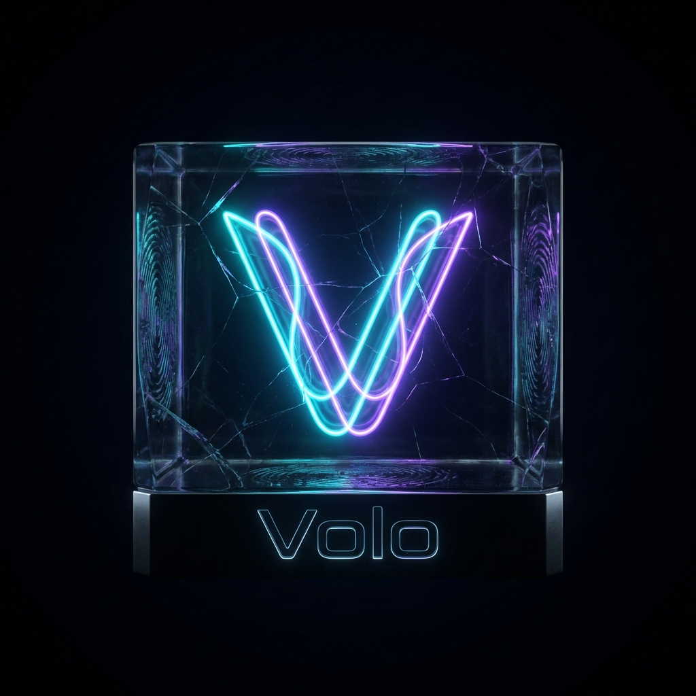

# Volo - Premium Messaging Experience

<div align="center">
  <a href="https://github.com/your-username/volo-messenger">
    
  </a>
  <h3 align="center">Volo Messenger</h3>
  <p align="center">
    The Future of Real-Time Communication
    <br />
    <a href="#-key-features"><strong>Explore the docs »</strong></a>
    <br />
    <br />
    <a href="https://volo-demo.vercel.app">View Demo</a>
    ·
    <a href="https://github.com/your-username/volo-messenger/issues">Report Bug</a>
    ·
    <a href="https://github.com/your-username/volo-messenger/issues">Request Feature</a>
  </p>
</div>

<div align="center">


</div>

---

## 📋 Table of Contents

- [About The Project](#-about-the-project)
  - [Built With](#-built-with)
- [Key Features](#-key-features)
- [Getting Started](#-getting-started)
  - [Prerequisites](#prerequisites)
  - [Installation](#installation)
- [Roadmap](#-roadmap)
- [Contributing](#-contributing)
- [License](#-license)
- [Contact](#-contact)

---

## 💎 About The Project

**Volo** is not just another messaging app. It is a re-imagination of digital connection, prioritizing **speed**, **security**, and **aesthetic excellence**. 

Built on the latest "Bleeding Edge" stack of Next.js 14 and React 18, Volo offers a seamless, native-like experience on the web. The interface features a bespoke **Neon Dark Mode** with glassmorphism elements, ensuring that your chats look as good as they feel.

### 🔧 Built With

*   **Framework**: [Next.js 14](https://nextjs.org/) (App Router & Server Actions)
*   **Database**: [MongoDB](https://www.mongodb.com/) (NoSQL Scalability)
*   **ORM**: [Prisma](https://www.prisma.io/) (Type-safe Database Access)
*   **Real-time Engine**: [Pusher](https://pusher.com/) (WebSockets)
*   **Authentication**: [NextAuth.js](https://next-auth.js.org/) (OAuth + Credentials)
*   **Styling**: [Tailwind CSS](https://tailwindcss.com/) + [Headless UI](https://headlessui.com/)

---

## 🚀 Key Features

| Feature | Description |
| :--- | :--- |
| **🎨 Premium UI/UX** | A deeply immersive **Dark Mode** with neon accents (Cyan/Violet) and frosted glass aesthetic. |
| **⚡ Real-time Sync** | Instant message delivery, new conversation alerts, and live typing indicators. |
| **🔒 Secure Auth** | Enterprise-grade authentication via Google, GitHub, or secure Credentials. |
| **📸 Media Sharing** | Cloud-optimized image uploading and rendering via Cloudinary. |
| **👥 Group Chats** | Create, manage, and administer group conversations with ease. |
| **📱 Mobile First** | A fully responsive design that adapts perfectly to any device size. |
| **👀 Read Receipts** | Know exactly when your messages are seen with avatar-based indicators. |

---

## 🏁 Getting Started

To get a local copy up and running, follow these simple steps.

### Prerequisites

*   **Node.js** (v18.17.0 or higher)
*   **npm** or **yarn**
*   **MongoDB** Instance (Atlas recommended)

### Installation

1.  **Clone the repo**
    ```sh
    git clone https://github.com/your-username/volo-messenger.git
    cd volo-messenger
    ```

2.  **Install NPM packages**
    ```sh
    npm install
    ```

3.  **Configure Environment**
    Create a `.env` file in the root directory:
    ```env
    DATABASE_URL="mongodb+srv://<username>:<password>@cluster.mongodb.net/test"
    NEXTAUTH_SECRET="super_secret_key"
    NEXTAUTH_URL="http://localhost:3000"

    # Social Providers
    GITHUB_ID="your_github_client_id"
    GITHUB_SECRET="your_github_client_secret"
    GOOGLE_CLIENT_ID="your_google_client_id"
    GOOGLE_CLIENT_SECRET="your_google_client_secret"

    # Cloudinary
    NEXT_PUBLIC_CLOUDINARY_CLOUD_NAME="your_cloud_name"

    # Pusher
    NEXT_PUBLIC_PUSHER_APP_KEY="your_pusher_key"
    PUSHER_APP_ID="your_pusher_app_id"
    PUSHER_SECRET="your_pusher_secret"
    NEXT_PUBLIC_PUSHER_CLUSTER="mt1"
    ```

4.  **Sync Database**
    ```sh
    npx prisma generate
    npx prisma db push
    ```

5.  **Start Development Server**
    ```sh
    npm run dev
    ```

---

## 🗺️ Roadmap

- [x] **Core Messaging**: Real-time text and One-on-One chats.
- [x] **Group Chats**: Multi-user conversations.
- [x] **Media Support**: Image sharing.
- [x] **Volo Rebrand**: Complete UI overhaul with Neon/Glass theme.
- [ ] **Voice/Video Calls**: WebRTC integration.
- [ ] **File Sharing**: Support for documents and zip files.
- [ ] **E2E Encryption**: Signal protocol implementation.

See the [open issues](https://github.com/your-username/volo-messenger/issues) for a full list of proposed features.

---

## 🤝 Contributing

Contributions are what make the open source community such an amazing place to learn, inspire, and create. Any contributions you make are **greatly appreciated**.

1.  Fork the Project
2.  Create your Feature Branch (`git checkout -b feature/AmazingFeature`)
3.  Commit your Changes (`git commit -m 'Add some AmazingFeature'`)
4.  Push to the Branch (`git push origin feature/AmazingFeature`)
5.  Open a Pull Request

---

## 📄 License

Distributed under the MIT License. See `LICENSE` for more information.

---

## ✉️ Contact

Your Name - [@your_twitter](https://twitter.com/your_username) - email@example.com

Project Link: [https://github.com/your-username/volo-messenger](https://github.com/your-username/volo-messenger)
